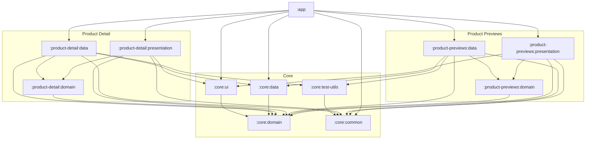

# Product Catalog

A Product Catalog app built as a technical assessment for the Junior Mobile Developer role at Neurogine.

---

## Screenshots

| List | Detail | Search |
|---|---|---|
|  |  |  |

| Loading (Shimmer) | Error / Retry | Pull-to-Refresh |
|---|---|---|
|  |  |  |

---

## Tech Stack

- **Language:** Kotlin
- **Platform:** Android Native (Presentation layer) + Kotlin Multiplatform (Domain & Data layers)
- **UI:** Jetpack Compose
- **Networking:** Ktor
- **Dependency Injection:** Koin
- **Image Loading:** Coil
- **Async/State:** Kotlin Coroutines & Flow
- **Pagination:** AndroidX Paging 3
- **Testing:** Kotlin Test + Mokkery

---

## How to Run

1. Clone the project from GitHub:
   ```
   git clone https://github.com/HighOverseer/MyProductCatalogApp.git
   ```
2. Open the project in Android Studio.
3. Add the following line to your `local.properties` file:
   ```
   BASE_URL=https://dummyjson.com/products/
   ```
4. Wait for Gradle Sync to finish.
5. Run the project on an emulator or physical device.

---

## Architecture Overview

The project uses a modularized **Clean Architecture** approach, combining Android-native Kotlin for the presentation layer with **Kotlin Multiplatform (KMP)** for the domain and data layers, to showcase KMP-ready business logic that could be shared across platforms in the future.

Two feature modules were deliberately created which are `product-previews` and `product-detail`, rather than a single module, specifically to demonstrate a scalable, multi-module KMP setup, even though the app's current scope could technically fit into one module.

Each feature module is split into three layers:
- **Presentation** — UI, ViewModels, and platform-specific glue (Android-only)
- **Domain** — use cases / business rules (Kotlin Multiplatform, no platform dependencies)
- **Data** — repositories and data sources (Kotlin Multiplatform)

### Module Dependency Graph



| Module | Depends On |
|---|---|
| `:core:domain` | — (no dependencies) |
| `:core:data` | `:core:domain` |
| `:core:ui` | `:core:domain` |
| `:core:common` | — (no dependencies) |
| `:core:test-utils` | `:core:common` |
| `:product-previews:presentation` | `:product-previews:domain`, `:core:domain`, `:core:common`, `:core:ui` |
| `:product-previews:domain` | `:core:domain` |
| `:product-previews:data` | `:product-previews:domain`, `:core:domain`, `:core:data`, `:core:common`, `:core:test-utils` |
| `:product-detail:presentation` | `:product-detail:domain`, `:core:domain`, `:core:common`, `:core:ui` |
| `:product-detail:domain` | `:core:domain` |
| `:product-detail:data` | `:product-detail:domain`, `:core:domain`, `:core:data`, `:core:common`, `:core:test-utils` |
| `:app` | `:core:data`, `:core:common`, `:core:ui`, `:product-previews:data`, `:product-previews:presentation`, `:product-detail:data`, `:product-detail:presentation` |

---

## Key Architectural Decisions

**1. Where to place the Paging Source implementation**
Initially planned for the data layer, but putting it there would have forced the domain module to depend on the Paging 3 library. Since the data module is a Kotlin Multiplatform module, the Paging Source also couldn't live in `commonMain`, as that source set is meant to stay platform-agnostic. The Paging Source was moved into the feature's **presentation** module instead, acting as an adapter, the data layer only knows how to fetch data given a `limit` and `skip`, while all pagination mechanics live in presentation.

**2. Where to place the `LazyPagingItems` helper extension function**
Considered `:core:ui` since the function is generic and reusable, but that would require adding the Paging 3 dependency to a shared UI module just for one extension function, an unnecessary coupling. It was placed in `:product-previews:presentation` instead, the only module currently using it. If a second module needs it later, it will be promoted to `:core:ui`.

**3. Client-side debounced search**
Search filtering is debounced client-side in the ViewModel (presentation layer) rather than relying purely on the search endpoint, to keep full control over UI states (loading/error/empty/success) in one place. Delegating this to the endpoint would push that state logic into the data layer, reducing control over how the UI reacts.

---

## Features Implemented

### Required
- [x] Product list screen (title, thumbnail, price)
- [x] Pagination via `skip` parameter, loads more on scroll
- [x] Product detail screen (description, price, rating, images)
- [x] Loading, error (with retry), empty, and success states
- [x] Debounced client-side search
- [x] Code organized into presentation / domain / data layers

### Bonus
- [x] Pull-to-refresh
- [x] Image loading placeholder & error handling
- [x] Unit test for business/data logic
- [x] Shimmering loading placeholder for a seamless UX
- [x] Collapsing app bar on the list screen for more screen real estate while scrolling
- [x] Splash screen

---

## Known Issues / TODOs

None — all required and bonus features were completed within the time box.

---

## AI Usage Disclosure

In line with the assessment's AI usage policy, AI was used for Research & Discussion purposes only, used as a sounding board to weigh trade-offs between implementation options (e.g., where to place the Paging Source and the `LazyPagingItems` extension — see *Key Architectural Decisions* above) and to clarify Android/Kotlin concepts when uncertain.


All core logic, project structure, and architectural decisions are my own. I'm able to walk through and explain every line of code in the accompanying walkthrough video.

---

## Author

**Fajar Alif Riyandi**
Submission for: Junior Mobile Developer — Neurogine
